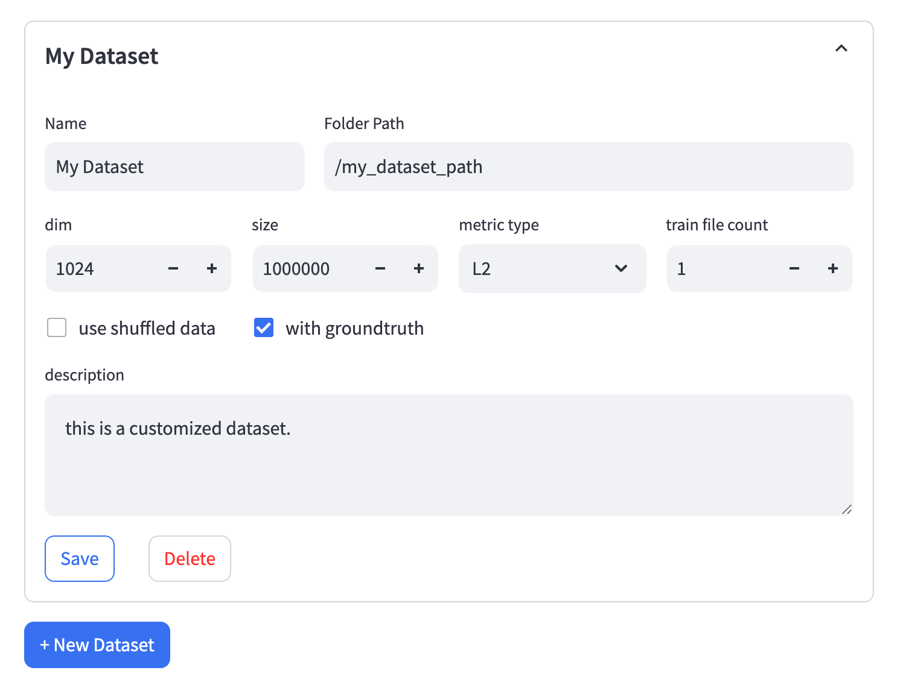
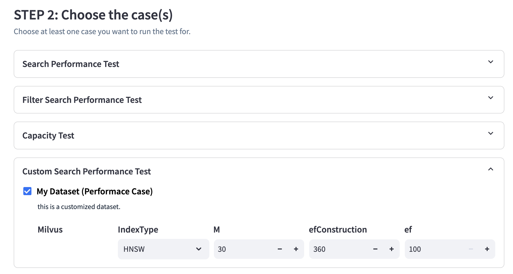

# VectorDBBench: A Benchmark Tool for VectorDB

[](https://pypi.org/project/vectordb-bench/)
[](https://pepy.tech/project/vectordb-bench)

## What is VectorDBBench
VectorDBBench is not just an offering of benchmark results for mainstream vector databases and cloud services, it's your go-to tool for the ultimate performance and cost-effectiveness comparison. Designed with ease-of-use in mind, VectorDBBench is devised to help users, even non-professionals, reproduce results or test new systems, making the hunt for the optimal choice amongst a plethora of cloud services and open-source vector databases a breeze.

Understanding the importance of user experience, we provide an intuitive visual interface. This not only empowers users to initiate benchmarks at ease, but also to view comparative result reports, thereby reproducing benchmark results effortlessly.
To add more relevance and practicality, we provide cost-effectiveness reports particularly for cloud services. This allows for a more realistic and applicable benchmarking process.

Closely mimicking real-world production environments, we've set up diverse testing scenarios including insertion, searching, and filtered searching. To provide you with credible and reliable data, we've included public datasets from actual production scenarios, such as [SIFT](http://corpus-texmex.irisa.fr/), [GIST](http://corpus-texmex.irisa.fr/), [Cohere](https://huggingface.co/datasets/Cohere/wikipedia-22-12/tree/main/en), and a dataset generated by OpenAI from an opensource [raw dataset](https://huggingface.co/datasets/allenai/c4). It's fascinating to discover how a relatively unknown open-source database might excel in certain circumstances!

Prepare to delve into the world of VectorDBBench, and let it guide you in uncovering your perfect vector database match.  

VectorDBBench is sponsered by Zilliz，the leading opensource vectorDB company behind Milvus. Choose smarter with VectorDBBench- start your free test on [zilliz cloud](https://zilliz.com/) today!

**Leaderboard:** https://zilliz.com/benchmark
## Quick Start
### Prerequirement
``` shell
python >= 3.11
```
### Install
**Install vectordb-bench with only PyMilvus**
```shell
pip install vectordb-bench
```

**Install all database clients**

``` shell
pip install vectordb-bench[all]
```
**Install the specific database client**

```shell
pip install vectordb-bench[pinecone]
```
All the database client supported

| Optional database client | install command                             |
|--------------------------|---------------------------------------------|
| pymilvus, zilliz_cloud (*default*)     | `pip install vectordb-bench`                |
| all (*clients requirements might be conflict with each other*) | `pip install vectordb-bench[all]`           |
| qdrant                   | `pip install vectordb-bench[qdrant]`        |
| pinecone                 | `pip install vectordb-bench[pinecone]`      |
| weaviate                 | `pip install vectordb-bench[weaviate]`      |
| elastic, aliyun_elasticsearch| `pip install vectordb-bench[elastic]`       |
| pgvector, pgvectorscale, pgdiskann, alloydb | `pip install vectordb-bench[pgvector]`      |
| pgvecto.rs               | `pip install vectordb-bench[pgvecto_rs]`    |
| redis                    | `pip install vectordb-bench[redis]`         |
| memorydb                 | `pip install vectordb-bench[memorydb]`      |
| chromadb                 | `pip install vectordb-bench[chromadb]`      |
| awsopensearch            | `pip install vectordb-bench[opensearch]` |
| aliyun_opensearch        | `pip install vectordb-bench[aliyun_opensearch]` |
| mongodb                  | `pip install vectordb-bench[mongodb]`       |
| tidb                     | `pip install vectordb-bench[tidb]`          |
| vespa                    | `pip install vectordb-bench[vespa]`         |

### Run

``` shell
init_bench
```

OR:

### Run from the command line.

``` shell
vectordbbench [OPTIONS] COMMAND [ARGS]...
```
To list the clients that are runnable via the commandline option, execute: `vectordbbench --help`
``` text
$ vectordbbench --help
Usage: vectordbbench [OPTIONS] COMMAND [ARGS]...

Options:
  --help  Show this message and exit.

Commands:
  pgvectorhnsw
  pgvectorivfflat
  test
  weaviate
```
To list the options for each command, execute `vectordbbench [command] --help`

```text
$ vectordbbench pgvectorhnsw --help
Usage: vectordbbench pgvectorhnsw [OPTIONS]

Options:
  --config-file PATH              Read configuration from yaml file
  --drop-old / --skip-drop-old    Drop old or skip  [default: drop-old]
  --load / --skip-load            Load or skip  [default: load]
  --search-serial / --skip-search-serial
                                  Search serial or skip  [default: search-
                                  serial]
  --search-concurrent / --skip-search-concurrent
                                  Search concurrent or skip  [default: search-
                                  concurrent]
  --case-type [CapacityDim128|CapacityDim960|Performance768D100M|Performance768D10M|Performance768D1M|Performance768D10M1P|Performance768D1M1P|Performance768D10M99P|Performance768D1M99P|Performance1536D500K|Performance1536D5M|Performance1536D500K1P|Performance1536D5M1P|Performance1536D500K99P|Performance1536D5M99P|Performance1536D50K]
                                  Case type
  --db-label TEXT                 Db label, default: date in ISO format
                                  [default: 2024-05-20T20:26:31.113290]
  --dry-run                       Print just the configuration and exit
                                  without running the tasks
  --k INTEGER                     K value for number of nearest neighbors to
                                  search  [default: 100]
  --concurrency-duration INTEGER  Adjusts the duration in seconds of each
                                  concurrency search  [default: 30]
  --num-concurrency TEXT          Comma-separated list of concurrency values
                                  to test during concurrent search  [default:
                                  1,10,20]
  --user-name TEXT                Db username  [required]
  --password TEXT                 Db password  [required]
  --host TEXT                     Db host  [required]
  --db-name TEXT                  Db name  [required]
  --maintenance-work-mem TEXT     Sets the maximum memory to be used for
                                  maintenance operations (index creation). Can
                                  be entered as string with unit like '64GB'
                                  or as an integer number of KB.This will set
                                  the parameters:
                                  max_parallel_maintenance_workers,
                                  max_parallel_workers &
                                  table(parallel_workers)
  --max-parallel-workers INTEGER  Sets the maximum number of parallel
                                  processes per maintenance operation (index
                                  creation)
  --m INTEGER                     hnsw m
  --ef-construction INTEGER       hnsw ef-construction
  --ef-search INTEGER             hnsw ef-search
  --quantization-type [none|bit|halfvec]
                                  quantization type for vectors (in index)
  --table-quantization-type [none|bit|halfvec]
                                  quantization type for vectors (in table). If
                                  equal to bit, the parameter
                                  quantization_type will be set to bit too.
  --custom-case-name TEXT         Custom case name i.e. PerformanceCase1536D50K
  --custom-case-description TEXT  Custom name description
  --custom-case-load-timeout INTEGER
                                  Custom case load timeout [default: 36000]
  --custom-case-optimize-timeout INTEGER
                                  Custom case optimize timeout [default: 36000]
  --custom-dataset-name TEXT
                                  Dataset name i.e OpenAI
  --custom-dataset-dir TEXT       Dataset directory i.e. openai_medium_500k
  --custom-dataset-size INTEGER   Dataset size i.e. 500000
  --custom-dataset-dim INTEGER    Dataset dimension
  --custom-dataset-metric-type TEXT
                                  Dataset distance metric [default: COSINE]
  --custom-dataset-file-count INTEGER
                                  Dataset file count
  --custom-dataset-use-shuffled / --skip-custom-dataset-use-shuffled
                                  Use shuffled custom dataset or skip  [default: custom-dataset-
                                  use-shuffled]
  --custom-dataset-with-gt / --skip-custom-dataset-with-gt
                                  Custom dataset with ground truth or skip  [default: custom-dataset-
                                  with-gt]
  --help                          Show this message and exit.
```

### Run awsopensearch from command line

```shell
vectordbbench awsopensearch --db-label awsopensearch \
--m 16 --ef-construction 256 \
--host search-vector-db-prod-h4f6m4of6x7yp2rz7gdmots7w4.us-west-2.es.amazonaws.com --port 443 \
--user vector --password '<password>' \
--case-type Performance1536D5M --num-insert-workers 10  \
--skip-load --num-concurrency 75
```

To list the options for awsopensearch, execute `vectordbbench awsopensearch --help`

```text
$ vectordbbench awsopensearch --help
Usage: vectordbbench awsopensearch [OPTIONS]

Options:
  # Sharding and Replication
  --number-of-shards INTEGER      Number of primary shards for the index
  --number-of-replicas INTEGER    Number of replica copies for each primary
                                  shard
  # Indexing Performance                              
  --index-thread-qty INTEGER      Thread count for native engine indexing
  --index-thread-qty-during-force-merge INTEGER
                                  Thread count during force merge operations
  --number-of-indexing-clients INTEGER
                                  Number of concurrent indexing clients
  # Index Management
  --number-of-segments INTEGER    Target number of segments after merging
  --refresh-interval TEXT         How often to make new data available for
                                  search
  --force-merge-enabled BOOLEAN   Whether to perform force merge operation
  --flush-threshold-size TEXT     Size threshold for flushing the transaction
                                  log
  # Memory Management
  --cb-threshold TEXT             k-NN Memory circuit breaker threshold

  --help                          Show this message and exit.```

#### Using a configuration file.

The vectordbbench command can optionally read some or all the options from a yaml formatted configuration file.

By default, configuration files are expected to be in vectordb_bench/config-files/, this can be overridden by setting  
the environment variable CONFIG_LOCAL_DIR or by passing the full path to the file. 

The required format is:
```yaml
commandname:
   parameter_name: parameter_value
   parameter_name: parameter_value
```
Example:
```yaml
pgvectorhnsw:
  db_label: pgConfigTest
  user_name: vectordbbench
  password: vectordbbench
  db_name:  vectordbbench
  host: localhost
  m: 16
  ef_construction: 128
  ef_search: 128
milvushnsw:
  skip_search_serial: True
  case_type: Performance1536D50K
  uri: http://localhost:19530
  m: 16
  ef_construction: 128
  ef_search: 128
  drop_old: False
  load: False
```
> Notes: 
> - Options passed on the command line will override the configuration file*
> - Parameter names use an _ not -

## Leaderboard
### Introduction
To facilitate the presentation of test results and provide a comprehensive performance analysis report, we offer a [leaderboard page](https://zilliz.com/benchmark). It allows us to choose from QPS, QP$, and latency metrics, and provides a comprehensive assessment of a system's performance based on the test results of various cases and a set of scoring mechanisms (to be introduced later). On this leaderboard, we can select the systems and models to be compared, and filter out cases we do not want to consider. Comprehensive scores are always ranked from best to worst, and the specific test results of each query will be presented in the list below.

### Scoring Rules

1. For each case, select a base value and score each system based on relative values. 
    - For QPS and QP$, we use the highest value as the reference, denoted as `base_QPS` or `base_QP$`, and the score of each system is `(QPS/base_QPS) * 100` or `(QP$/base_QP$) * 100`. 
    - For Latency, we use the lowest value as the reference, that is, `base_Latency`, and the score of each system is `(base_Latency + 10ms)/(Latency + 10ms) * 100`. 

    We want to give equal weight to different cases, and not let a case with high absolute result values become the sole reason for the overall scoring. Therefore, when scoring different systems in each case, we need to use relative values. 

    Also, for Latency, we add 10ms to the numerator and denominator to ensure that if every system performs particularly well in a case, its advantage will not be infinitely magnified when latency tends to 0.

2. For systems that fail or timeout in a particular case, we will give them a score based on a value worse than the worst result by a factor of two. For example, in QPS or QP$, it would be half the lowest value. For Latency, it would be twice the maximum value.

3. For each system, we will take the geometric mean of its scores in all cases as its comprehensive score for a particular metric.

## Build on your own
### Install requirements
``` shell
pip install -e '.[test]'

pip install -e '.[pinecone]'
```
### Run test server
```
python -m vectordb_bench
```

OR:

```shell
init_bench
```

OR:

If you are using [dev container](https://code.visualstudio.com/docs/devcontainers/containers), create
the following dataset directory first:

```shell
# Mount local ~/vectordb_bench/dataset to contain's /tmp/vectordb_bench/dataset.
# If you are not comfortable with the path name, feel free to change it in devcontainer.json
mkdir -p ~/vectordb_bench/dataset
```
After reopen the repository in container, run `python -m vectordb_bench` in the container's bash.

### Check coding styles
```shell
make lint
```

To fix the coding styles automatically

```shell
make format
```

## How does it work?
### Result Page

This is the main page of VectorDBBench, which displays the standard benchmark results we provide. Additionally, results of all tests performed by users themselves will also be shown here. We also offer the ability to select and compare results from multiple tests simultaneously.

The standard benchmark results displayed here include all 15 cases that we currently support for 6 of our clients (Milvus, Zilliz Cloud, Elastic Search, Qdrant Cloud, Weaviate Cloud and PgVector). However, as some systems may not be able to complete all the tests successfully due to issues like Out of Memory (OOM) or timeouts, not all clients are included in every case.

All standard benchmark results are generated by a client running on an 8 core, 32 GB host, which is located in the same region as the server being tested. The client host is equipped with an `Intel(R) Xeon(R) Platinum 8375C CPU @ 2.90GHz` processor. Also all the servers for the open-source systems tested in our benchmarks run on hosts with the same type of processor.
### Run Test Page

This is the page to run a test:
1. Initially, you select the systems to be tested - multiple selections are allowed. Once selected, corresponding forms will pop up to gather necessary information for using the chosen databases. The db_label is used to differentiate different instances of the same system. We recommend filling in the host size or instance type here (as we do in our standard results).
2. The next step is to select the test cases you want to perform. You can select multiple cases at once, and a form to collect corresponding parameters will appear.
3. Finally, you'll need to provide a task label to distinguish different test results. Using the same label for different tests will result in the previous results being overwritten.
Now we can only run one task at the same time. 

## Module
### Code Structure

### Client
Our client module is designed with flexibility and extensibility in mind, aiming to integrate APIs from different systems seamlessly. As of now, it supports Milvus, Zilliz Cloud, Elastic Search, Pinecone, Qdrant Cloud, Weaviate Cloud, PgVector, Redis, and Chroma. Stay tuned for more options, as we are consistently working on extending our reach to other systems.
### Benchmark Cases
We've developed an array of 15 comprehensive benchmark cases to test vector databases' various capabilities, each designed to give you a different piece of the puzzle. These cases are categorized into three main types:
#### Capacity Case
- **Large Dim:** Tests the database's loading capacity by inserting large-dimension vectors (GIST 100K vectors, 960 dimensions) until fully loaded. The final number of inserted vectors is reported.
- **Small Dim:** Similar to the Large Dim case but uses small-dimension vectors (SIFT 500K vectors, 128 dimensions).
#### Search Performance Case
- **XLarge Dataset:** Measures search performance with a massive dataset (LAION 100M vectors, 768 dimensions) at varying parallel levels. The results include index building time, recall, latency, and maximum QPS.
- **Large Dataset:** Similar to the XLarge Dataset case, but uses a slightly smaller dataset (10M-768dim, 5M-1536dim).
- **Medium Dataset:** A case using a medium dataset (1M-768dim, 500K-1536dim).
#### Filtering Search Performance Case
- **Large Dataset, Low Filtering Rate:** Evaluates search performance with a large dataset (10M-768dim, 5M-1536dim) under a low filtering rate (1% vectors) at different parallel levels.
- **Medium Dataset, Low Filtering Rate:** This case uses a medium dataset (1M-768dim, 500K-1536dim) with a similar low filtering rate.
- **Large Dataset, High Filtering Rate:** It tests with a large dataset (10M-768dim, 5M-1536dim) but under a high filtering rate (99% vectors).
- **Medium Dataset, High Filtering Rate:** This case uses a medium dataset (1M-768dim, 500K-1536dim) with a high filtering rate.
For a quick reference, here is a table summarizing the key aspects of each case:

Case No. | Case Type | Dataset Size  | Filtering Rate | Results |
|----------|-----------|--------------|----------------|---------|
1 | Capacity Case | SIFT 500K vectors, 128 dimensions | N/A | Number of inserted vectors |
2 | Capacity Case | GIST 100K vectors, 960 dimensions | N/A | Number of inserted vectors |
3 | Search Performance Case | LAION 100M vectors, 768 dimensions | N/A | Index building time, recall, latency, maximum QPS |
4 | Search Performance Case | Cohere 10M vectors, 768 dimensions | N/A | Index building time, recall, latency, maximum QPS |
5 | Search Performance Case | Cohere 1M vectors, 768 dimensions | N/A | Index building time, recall, latency, maximum QPS |
6 | Filtering Search Performance Case | Cohere 10M vectors, 768 dimensions | 1% vectors | Index building time, recall, latency, maximum QPS |
7 | Filtering Search Performance Case | Cohere 1M vectors, 768 dimensions | 1% vectors | Index building time, recall, latency, maximum QPS |
8 | Filtering Search Performance Case | Cohere 10M vectors, 768 dimensions | 99% vectors | Index building time, recall, latency, maximum QPS |
9 | Filtering Search Performance Case | Cohere 1M vectors, 768 dimensions | 99% vectors | Index building time, recall, latency, maximum QPS |
10 | Search Performance Case | OpenAI generated 500K vectors, 1536 dimensions | N/A | Index building time, recall, latency, maximum QPS |
11 | Search Performance Case | OpenAI generated 5M vectors, 1536 dimensions | N/A | Index building time, recall, latency, maximum QPS |
12 | Filtering Search Performance Case | OpenAI generated 500K vectors, 1536 dimensions | 1% vectors | Index building time, recall, latency, maximum QPS |
13 | Filtering Search Performance Case | OpenAI generated 5M vectors, 1536 dimensions | 1% vectors | Index building time, recall, latency, maximum QPS |
14 | Filtering Search Performance Case | OpenAI generated 500K vectors, 1536 dimensions | 99% vectors | Index building time, recall, latency, maximum QPS |
15 | Filtering Search Performance Case | OpenAI generated 5M vectors, 1536 dimensions | 99% vectors | Index building time, recall, latency, maximum QPS |


Each case provides an in-depth examination of a vector database's abilities, providing you a comprehensive view of the database's performance.

#### Custom Dataset for Performance case

Through the `/custom` page, users can customize their own performance case using local datasets. After saving, the corresponding case can be selected from the `/run_test` page to perform the test.




We have strict requirements for the data set format, please follow them.
- `Folder Path` - The path to the folder containing all the files. Please ensure that all files in the folder are in the `Parquet` format.
  - Vectors data files: The file must be named `train.parquet` and should have two columns: `id` as an incrementing `int` and `emb` as an array of `float32`.
  - Query test vectors: The file must be named `test.parquet` and should have two columns: `id` as an incrementing `int` and `emb` as an array of `float32`.
    - We recommend limiting the number of test query vectors, like 1,000.
    When conducting concurrent query tests, Vdbbench creates a large number of processes. 
    To minimize additional communication overhead during testing, 
    we prepare a complete set of test queries for each process, allowing them to run independently.
    However, this means that as the number of concurrent processes increases, 
    the number of copied query vectors also increases significantly, 
    which can place substantial pressure on memory resources.
  - Ground truth file: The file must be named `neighbors.parquet` and should have two columns: `id` corresponding to query vectors and `neighbors_id` as an array of `int`.

- `Train File Count` - If the vector file is too large, you can consider splitting it into multiple files. The naming format for the split files should be `train-[index]-of-[file_count].parquet`. For example, `train-01-of-10.parquet` represents the second file (0-indexed) among 10 split files.

- `Use Shuffled Data` - If you check this option, the vector data files need to be modified. VectorDBBench will load the data labeled with `shuffle`. For example, use `shuffle_train.parquet` instead of `train.parquet` and `shuffle_train-04-of-10.parquet` instead of `train-04-of-10.parquet`. The `id` column in the shuffled data can be in any order.


## Goals
Our goals of this benchmark are:
### Reproducibility & Usability
One of the primary goals of VectorDBBench is to enable users to reproduce benchmark results swiftly and easily, or to test their customized scenarios. We believe that lowering the barriers to entry for conducting these tests will enhance the community's understanding and improvement of vector databases. We aim to create an environment where any user, regardless of their technical expertise, can quickly set up and run benchmarks, and view and analyze results in an intuitive manner.
### Representability & Realism
VectorDBBench aims to provide a more comprehensive, multi-faceted testing environment that accurately represents the complexity of vector databases. By moving beyond a simple speed test for algorithms, we hope to contribute to a better understanding of vector databases in real-world scenarios. By incorporating as many complex scenarios as possible, including a variety of test cases and datasets, we aim to reflect realistic conditions and offer tangible significance to our community. Our goal is to deliver benchmarking results that can drive tangible improvements in the development and usage of vector databases.

## Contribution
### General Guidelines
1. Fork the repository and create a new branch for your changes.
2. Adhere to coding conventions and formatting guidelines.
3. Use clear commit messages to document the purpose of your changes.
### Adding New Clients
**Step 1: Creating New Client Files**

1. Navigate to the vectordb_bench/backend/clients directory.
2. Create a new folder for your client, for example, "new_client".
3. Inside the "new_client" folder, create two files: new_client.py and config.py.

**Step 2: Implement new_client.py and config.py**

1. Open new_client.py and define the NewClient class, which should inherit from the clients/api.py file's VectorDB abstract class. The VectorDB class serves as the API for benchmarking, and all DB clients must implement this abstract class. 
Example implementation in new_client.py:
new_client.py
```python 
from ..api import VectorDB
class NewClient(VectorDB):
    # Implement the abstract methods defined in the VectorDB class
    # ...
```
2. Open config.py and implement the DBConfig and optional DBCaseConfig classes.
  1. The DBConfig class should be an abstract class that provides information necessary to establish connections with the database. It is recommended to use the pydantic.SecretStr data type to handle sensitive data such as tokens, URIs, or passwords.
  2. The DBCaseConfig class is optional and allows for providing case-specific configurations for the database. If not provided, it defaults to EmptyDBCaseConfig.
Example implementation in config.py:
```python
from pydantic import SecretStr
from clients.api import DBConfig, DBCaseConfig

class NewDBConfig(DBConfig):
    # Implement the required configuration fields for the database connection
    # ...
    token: SecretStr
    uri: str

class NewDBCaseConfig(DBCaseConfig):
    # Implement optional case-specific configuration fields
    # ...
```

**Step 3: Importing the DB Client and Updating Initialization**

In this final step, you will import your DB client into clients/__init__.py and update the initialization process.
1. Open clients/__init__.py and import your NewClient from new_client.py.
2. Add your NewClient to the DB enum. 
3. Update the db2client dictionary by adding an entry for your NewClient.
Example implementation in clients/__init__.py:

```python
#clients/__init__.py

# Add NewClient to the DB enum
class DB(Enum):
    ...
    DB.NewClient = "NewClient"

    @property
    def init_cls(self) -> Type[VectorDB]:
        ...
        if self == DB.NewClient:
            from .new_client.new_client import NewClient
            return NewClient
        ...

    @property
    def config_cls(self) -> Type[DBConfig]:
        ...
        if self == DB.NewClient:
            from .new_client.config import NewClientConfig
            return NewClientConfig
        ...

    def case_config_cls(self, ...)
        if self == DB.NewClient:
            from .new_client.config import NewClientCaseConfig
            return NewClientCaseConfig

```
**Step 4: Implement new_client/cli.py and vectordb_bench/cli/vectordbbench.py**

In this (optional, but encouraged) step you will enable the test to be run from the command line.
1. Navigate to the vectordb_bench/backend/clients/"client" directory.
2. Inside the "client" folder, create a cli.py file.
Using zilliz as an example cli.py:
```python
from typing import Annotated, Unpack

import click
import os
from pydantic import SecretStr

from vectordb_bench.cli.cli import (
    CommonTypedDict,
    cli,
    click_parameter_decorators_from_typed_dict,
    run,
)
from vectordb_bench.backend.clients import DB


class ZillizTypedDict(CommonTypedDict):
    uri: Annotated[
        str, click.option("--uri", type=str, help="uri connection string", required=True)
    ]
    user_name: Annotated[
        str, click.option("--user-name", type=str, help="Db username", required=True)
    ]
    password: Annotated[
        str,
        click.option("--password",
                     type=str,
                     help="Zilliz password",
                     default=lambda: os.environ.get("ZILLIZ_PASSWORD", ""),
                     show_default="$ZILLIZ_PASSWORD",
                     ),
    ]
    level: Annotated[
        str,
        click.option("--level", type=str, help="Zilliz index level", required=False),
    ]


@cli.command()
@click_parameter_decorators_from_typed_dict(ZillizTypedDict)
def ZillizAutoIndex(**parameters: Unpack[ZillizTypedDict]):
    from .config import ZillizCloudConfig, AutoIndexConfig

    run(
        db=DB.ZillizCloud,
        db_config=ZillizCloudConfig(
            db_label=parameters["db_label"],
            uri=SecretStr(parameters["uri"]),
            user=parameters["user_name"],
            password=SecretStr(parameters["password"]),
        ),
        db_case_config=AutoIndexConfig(
            params={parameters["level"]},
        ),
        **parameters,
    )
```
3. Update cli by adding:
   1. Add database specific options as an Annotated TypedDict, see ZillizTypedDict above.  
   2. Add index configuration specific options as an Annotated TypedDict. (example: vectordb_bench/backend/clients/pgvector/cli.py)
      1. May not be needed if there is only one index config.
      2. Repeat for each index configuration, nesting them if possible.  
   2. Add a index config specific function for each index type,  see Zilliz above.  The function name, in lowercase, will be the command name passed to the vectordbbench command.
   3. Update db_config and db_case_config to match client requirements
   4. Continue to add new functions for each index config.
   5. Import the client cli module and command to vectordb_bench/cli/vectordbbench.py (for databases with multiple commands (index configs), this only needs to be done for one command)  
   6. Import the `get_custom_case_config` function from `vectordb_bench/cli/cli.py` and use it to add a new key `custom_case` to the `parameters` variable within the command.


> cli modules with multiple index configs:
> - pgvector: vectordb_bench/backend/clients/pgvector/cli.py
> - milvus: vectordb_bench/backend/clients/milvus/cli.py

That's it! You have successfully added a new DB client to the vectordb_bench project.

## Rules
### Installation
The system under test can be installed in any form to achieve optimal performance. This includes but is not limited to binary deployment, Docker, and cloud services.
### Fine-Tuning
For the system under test, we use the default server-side configuration to maintain the authenticity and representativeness of our results.
For the Client, we welcome any parameter tuning to obtain better results.
### Incomplete Results
Many databases may not be able to complete all test cases due to issues such as Out of Memory (OOM), crashes, or timeouts. In these scenarios, we will clearly state these occurrences in the test results.
### Mistake Or Misrepresentation 
We strive for accuracy in learning and supporting various vector databases, yet there might be oversights or misapplications. For any such occurrences, feel free to [raise an issue](https://github.com/zilliztech/VectorDBBench/issues/new) or make amendments on our GitHub page.
## Timeout
In our pursuit to ensure that our benchmark reflects the reality of a production environment while guaranteeing the practicality of the system, we have implemented a timeout plan based on our experiences for various tests.

**1. Capacity Case:**
- For Capacity Case, we have assigned an overall timeout.

**2. Other Cases:**

For other cases, we have set two timeouts:

- **Data Loading Timeout:** This timeout is designed to filter out systems that are too slow in inserting data, thus ensuring that we are only considering systems that is able to cope with the demands of a real-world production environment within a reasonable time frame.

- **Optimization Preparation Timeout**: This timeout is established to avoid excessive optimization strategies that might work for benchmarks but fail to deliver in real production environments. By doing this, we ensure that the systems we consider are not only suitable for testing environments but also applicable and efficient in production scenarios.

This multi-tiered timeout approach allows our benchmark to be more representative of actual production environments and assists us in identifying systems that can truly perform in real-world scenarios.
<table>
    <tr>
        <th>Case</th>
        <th>Data Size</th>
        <th>Timeout Type</th>
        <th>Value</th>
    </tr>
    <tr>
        <td>Capacity Case</td>
        <td>N/A</td>
        <td>Loading timeout</td>
        <td>24 hours</td>
    </tr>
    <tr>
        <td rowspan="2">Other Cases</td>
        <td rowspan="2">1M vectors, 768 dimensions</br>500K vectors, 1536 dimensions</td>
        <td>Loading timeout</td>
        <td>2.5 hours</td>
    </tr>
    <tr>
        <td>Optimization timeout</td>
        <td>15 mins</td>
    </tr>
    <tr>
        <td rowspan="2">Other Cases</td>
        <td rowspan="2">10M vectors, 768 dimensions</br>5M vectors, 1536 dimensions</td>
        <td>Loading timeout</td>
        <td>25 hours</td>
    </tr>
    <tr>
        <td>Optimization timeout</td>
        <td>2.5 hours</td>
    </tr>
    <tr>
        <td rowspan="2">Other Cases</td>
        <td rowspan="2">100M vectors, 768 dimensions</td>
        <td>Loading timeout</td>
        <td>250 hours</td>
    </tr>
    <tr>
        <td>Optimization timeout</td>
        <td>25 hours</td>
    </tr>
</table>

**Note:** Some datapoints in the standard benchmark results that voilate this timeout will be kept for now for reference. We will remove them in the future.
